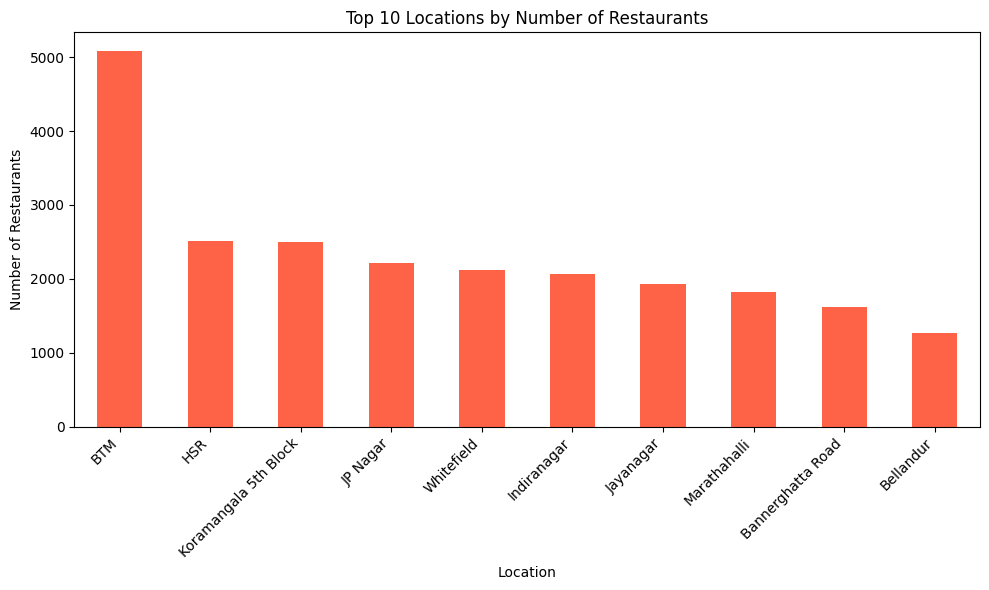
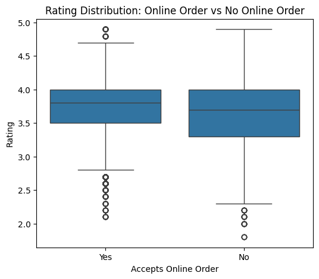
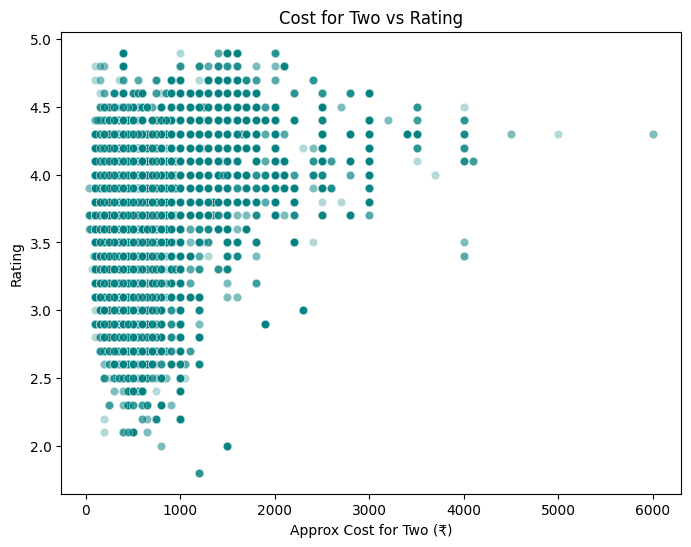
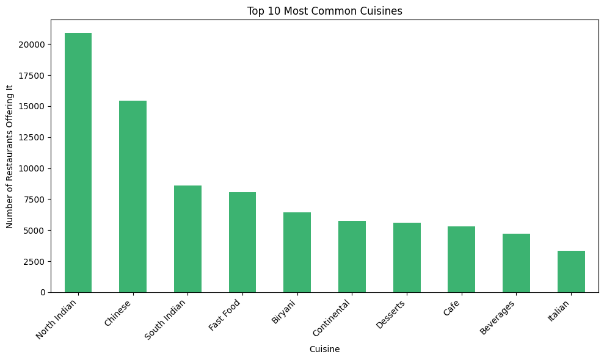
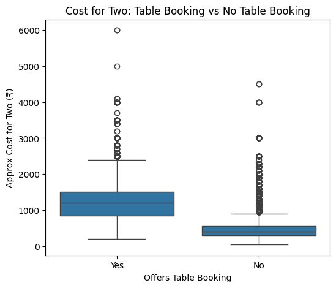

# Zomato Bangalore Restaurant Analysis
## Business Problem
If you were advising someone opening a new restaurant in Bangalore, what does the data say about location, pricing, and cuisine choices that correlate with success (measured by rating)?
## Dataset
Zomato Bangalore Restaurants — Kaggle (https://www.kaggle.com/datasets/himanshupoddar/zomato-bangalore-restaurants)
~51,700 restaurants, 17 original columns.
## What I Did
- Cleaned the `rate` column (extracted numeric rating from "X/5" text, removed "NEW"/"-" placeholders)
- Cleaned `approx_cost(for two people)` (removed comma formatting, converted to numeric)
- Dropped columns that were unusable (e.g. `dish_liked` was >50% missing) and removed duplicate rows
- Exploded the multi-value `cuisines` column so each cuisine could be analyzed individually rather than treating combinations as unique categories
- Analyzed 5 business questions using bar charts, box plots, and a scatter plot
## Key Insights
- BTM is Bangalore's most saturated restaurant market (~5,000 restaurants), roughly 2x the next most dense areas.

- Restaurants accepting online orders average a slightly higher rating (3.72 vs 3.66) — a mild correlation, not a strong driver.

- Cost and rating show a moderate positive correlation (0.38); restaurants priced above ₹3000 are almost never rated below 3.5.
## Tools
Python — pandas, matplotlib, seaborn — in Google Colab

## Notebook
Full code: [Zomato_analysis.ipynb](Zomato_analysis.ipynb)

- The most common cuisines (North Indian, Chinese) are not the highest-rated — niche cuisines like Malaysian and Japanese rate higher on average.

- Table booking availability is a strong proxy for price positioning — restaurants offering it cost ~2.8x more on average (₹1,271 vs ₹453).

